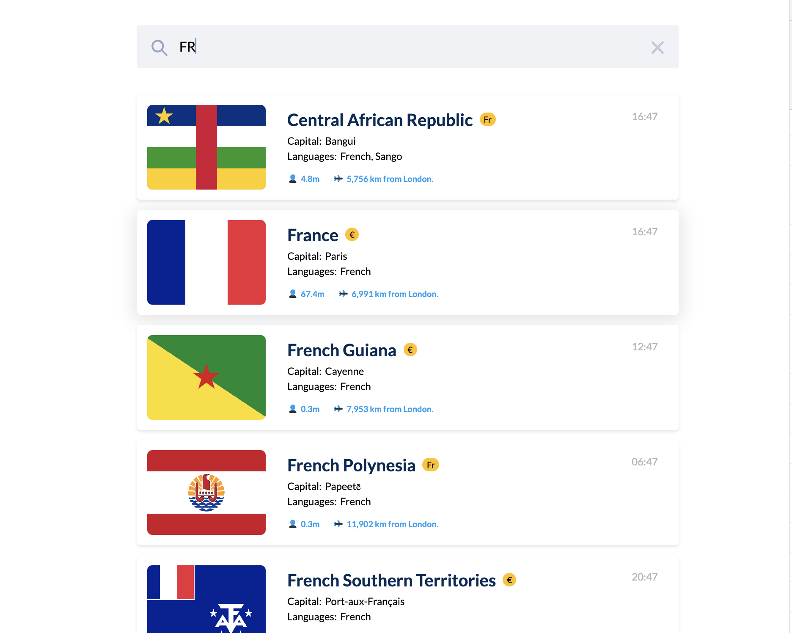

# Dynamic country information

Retreive country data using [RXJS](https://rxjs.dev/) in React. Built using rest countries API [resctounies.com](https://restcountries.com/). Includes a Geolocation to display current location using [reverse-geocode-client]. Styles written in [styled-components](https://styled-components.com/). This project was bootstrapped with [Create React App](https://github.com/facebook/create-react-app).

## Run the app

```bash
yarn start
```

Runs the app in the development mode.\
Open [http://localhost:3000](http://localhost:3000) to view it in the browser.

```bash
yarn build
```

Builds the app for production to the `build` folder.\
It correctly bundles React in production mode and optimizes the build for the best performance.

## Previews

[video of the app flow visible in the assets](./src/assets/Countries.mov)
